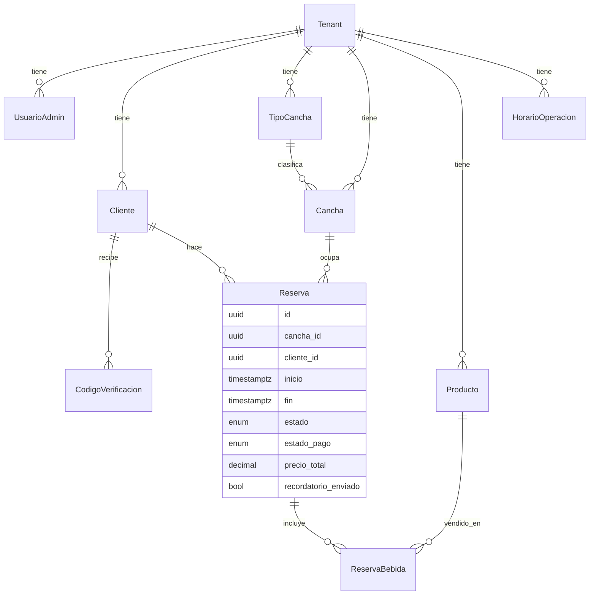

<div align="center">

# Reservas

**Sistema multi-tenant de reservas para complejos deportivos**

Canchas de vóley y pádel · panel de administración · app de cliente
Construido para revenderse: el mismo modelo de datos y las mismas capas de código sirven para otro negocio (ej. una barbería) con solo sembrar un nuevo tenant.

[](#)
[](#)
[](#)
[](#)
[](#)
[](#)

</div>

<br>

> [!NOTE]
> La exclusividad de horarios **no se valida solo en la aplicación**. Una restricción `EXCLUDE USING gist` de PostgreSQL rechaza a nivel de base de datos cualquier reserva que se solape con otra para la misma cancha — incluso bajo dos requests concurrentes. Ver [No solapamiento de reservas](#no-solapamiento-de-reservas-a-nivel-de-base-de-datos).

## Contenido

- [Funcionalidades](#funcionalidades)
- [Stack](#stack)
- [Modelo de datos](#modelo-de-datos)
- [No solapamiento de reservas](#no-solapamiento-de-reservas-a-nivel-de-base-de-datos)
- [Multi-tenancy](#multi-tenancy)
- [Autenticación](#autenticación)
- [WhatsApp (OTP, confirmación y recordatorios)](#whatsapp-otp-confirmación-y-recordatorios)
- [Estructura del repositorio](#estructura-del-repositorio)
- [Puesta en marcha](#puesta-en-marcha)
- [Notas de diseño](#notas-de-diseño)

## Funcionalidades

<table>
<tr>
<td valign="top" width="50%">

**Cliente**
- Registro/login unificado por teléfono + OTP (WhatsApp)
- Grilla de disponibilidad por cancha, selección de una o varias horas consecutivas (drag-select)
- Bebidas agregadas a la misma reserva, con descuento de inventario atómico
- Confirmación por WhatsApp al reservar: cancha, horario y total
- Recordatorio in-app 30 min antes (con cancelación gratuita) + recordatorio por WhatsApp 20 min antes
- Historial de reservas propias, con cancelación

</td>
<td valign="top" width="50%">

**Administrador**
- Acceso separado de la interfaz de cliente: sin links visibles, solo por URL directa (`/admin/login`)
- CRUD de tipos de cancha, canchas y productos, con imagen por URL
- Panel de reservas con filtros por fecha, estado y rango de horas
- Marcar reservas como pagadas/pendientes (bloqueado si está cancelada)
- Resumen del día: reservas totales, pagadas y monto cobrado

</td>
</tr>
</table>

## Stack

| Capa | Tecnología |
|---|---|
| Backend | Node.js + Express 5 |
| ORM / DB | Prisma 6.19 + PostgreSQL (extensión `btree_gist`) |
| Auth | JWT (`jsonwebtoken`) + `bcryptjs` |
| Mensajería | Twilio WhatsApp (mockeable a consola) + `node-cron` |
| Frontend | React 19 + Vite + React Router 7 |
| Estilos | CSS con variables de diseño (sin framework) · Bebas Neue + Inter |

## Modelo de datos

Todo el negocio cuelga de `Tenant`. Cada `Reserva` referencia una `Cancha` y un `Cliente`, y puede llevar productos asociados a través de `ReservaBebida`.



## No solapamiento de reservas (a nivel de base de datos)

Para evitar condiciones de carrera, la exclusividad de horarios por cancha no se valida solo en la capa de aplicación: la migración `no_reservas_cruzadas` agrega una restricción `EXCLUDE USING gist` sobre el rango `[inicio, fin)` de cada reserva.

```sql
ALTER TABLE "reservas" ADD CONSTRAINT "no_reservas_cruzadas"
EXCLUDE USING gist (
    "cancha_id" WITH =,
    tstzrange("inicio", "fin") WITH &&
) WHERE ("estado" <> 'CANCELADA'::"EstadoReserva");
```

Si dos requests concurrentes intentan reservar el mismo horario, PostgreSQL rechaza la segunda transacción y el backend la traduce a un `409`.

## Multi-tenancy

Todas las tablas de negocio (`Cancha`, `TipoCancha`, `Producto`, `Reserva`, `Cliente`, `UsuarioAdmin`, `HorarioOperacion`) tienen `tenant_id`. Hoy el sistema opera con un único tenant sembrado por el seed, pero el modelo ya está preparado para múltiples negocios sobre la misma base de datos.

## Autenticación

| | Método | Sesión |
|---|---|---|
| **Admin** | email + password | JWT de 8h · sin auto-registro, se crean por seed o manualmente |
| **Cliente** | teléfono (10 dígitos) + OTP por WhatsApp | JWT de 30 días |

No hay ningún link ni botón en la interfaz de cliente que lleve al login de admin — se accede solo entrando directo a `/admin/login`, para mantener la interfaz pública 100% orientada al cliente.

## WhatsApp (OTP, confirmación y recordatorios)

El flujo de cliente usa WhatsApp en tres momentos: envío del código OTP, confirmación al crear una reserva, y un recordatorio automático **20 minutos antes** de la hora reservada (además del aviso in-app a los 30 minutos, que sigue existiendo con su opción de cancelación gratuita).

Todo el envío pasa por un único punto: `backend/src/services/whatsappService.js`, que intenta usar **Twilio WhatsApp Sandbox** si encuentra `TWILIO_ACCOUNT_SID`, `TWILIO_AUTH_TOKEN` y `TWILIO_WHATSAPP_FROM` en el `.env`.

> [!IMPORTANT]
> **Estado actual: mockeado a consola.** El sandbox de Twilio exige que cada número autorice al remitente con un `join <palabra>` cada 72h — demasiada fricción para esta etapa, en la que el proyecto todavía no se vende ni se usa de forma recurrente. Mientras no haya credenciales configuradas, cada mensaje se imprime en la consola del backend con el prefijo `[WHATSAPP MOCK]` / `[OTP MOCK]`, y el resto del flujo (crear cliente, generar reserva, marcar el recordatorio como enviado) funciona exactamente igual que si el mensaje hubiera salido de verdad. Activar el envío real es solo completar esas tres variables de entorno — no hay que tocar código.

El recordatorio de 20 minutos corre como un cron (`node-cron`, cada minuto) en `backend/src/jobs/recordatorioWhatsappJob.js`, y usa el campo `recordatorio_enviado` de `Reserva` para no enviar el mismo aviso dos veces.

## Estructura del repositorio

```
reservas-proyect/
├── backend/
│   ├── prisma/
│   │   ├── schema.prisma       # Modelo de datos
│   │   ├── migrations/         # Incluye el EXCLUDE constraint anti-solapamiento
│   │   └── seed.js             # Crea tenant, admin y horarios iniciales
│   └── src/
│       ├── config/             # Prisma client, timezone (UTC-5 Colombia)
│       ├── routes/             # Definición de endpoints
│       ├── controllers/        # Parseo de request / respuesta HTTP
│       ├── services/           # Lógica de negocio (capa reutilizable)
│       ├── middlewares/        # Auth admin/cliente, manejo de errores
│       ├── jobs/                # Cron de recordatorios
│       └── utils/               # Validaciones compartidas
└── frontend/
    └── src/
        ├── api/                 # Clientes HTTP hacia el backend
        ├── context/             # AuthContext admin y cliente (JWT en localStorage)
        ├── components/          # Componentes reutilizables (ilustraciones, banners)
        ├── pages/admin/         # Panel de administración
        └── pages/cliente/       # App de reservas del cliente
```

## Puesta en marcha

**Requisitos:** Node.js 18+ y PostgreSQL con la extensión `btree_gist` disponible.

### Backend

```bash
cd backend
npm install
cp .env.example .env   # completar DATABASE_URL, JWT_SECRET, credenciales del admin
npx prisma migrate deploy
npx prisma db seed
npm run dev
```

| Variable | Descripción |
|---|---|
| `DATABASE_URL` | Cadena de conexión a PostgreSQL |
| `PORT` | Puerto del servidor (por defecto 3000) |
| `JWT_SECRET` | Secreto para firmar los JWT |
| `TENANT_NOMBRE` | Nombre del negocio sembrado por el seed |
| `ADMIN_EMAIL` / `ADMIN_PASSWORD` | Credenciales del admin inicial |
| `TWILIO_ACCOUNT_SID` / `TWILIO_AUTH_TOKEN` / `TWILIO_WHATSAPP_FROM` | Opcionales — sin configurar, WhatsApp queda mockeado a consola |

### Frontend

```bash
cd frontend
npm install
cp .env.example .env   # o crear .env con VITE_API_URL
npm run dev
```

| Variable | Descripción |
|---|---|
| `VITE_API_URL` | URL base del backend (ej. `http://localhost:3000/api`) |

## Notas de diseño

- El manejo de zona horaria (Colombia, UTC-5, sin horario de verano) está resuelto en `backend/src/config/timezone.js` como una constante global temporal; si el sistema se revende a un negocio en otra zona horaria, debería pasar a ser un campo por `Tenant`.
- Identidad visual **"Bloque de Cancha"**: verde `#39DC48` como color primario/CTA y lima `#D6FF00` como color de highlight/dato secundario, aplicada de forma consistente en Home, logins, app de cliente y panel de administración.
